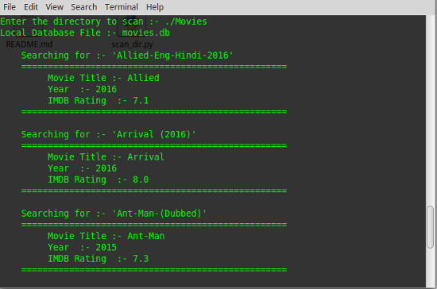
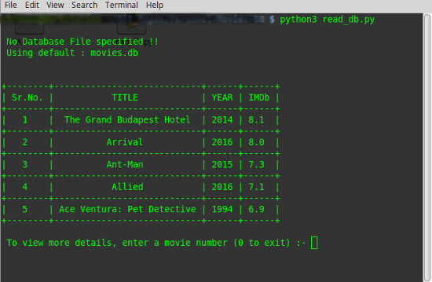
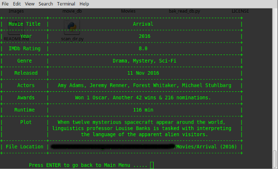

# Personal Movies Database Creator

#### Contributions [](https://github.com/digaru19/Personal-Movies-Database-Creator/issues)

#### Open-Source [](https://github.com/digaru19/Personal-Movies-Database-Creator) 


A small utility that scans a given directory, that contains Movies, and tries to fetch information about them from online APIs.
The fetched information is then stored in a Local SQLite Database, for later usages. 

#### Usage :-
To build a database :- 
```
python3 build_db.py <movie_directory_path>
```
To read a database :- 
```
python3 read_db.py <database_file_path>
```

#### Dependencies :-
- sqlite3              (`pip3 install sqlite3`)
- terminaltables (`pip3 install terminaltables`)
- requests           (`pip3 install requests`)
- Internet Connection :sweat_smile: 

#### Screenshots :-
- **Building** the Movies Database (`build_db.py`) , 
   

- **Reading** the Movies Database (`read_db.py`) , 
   
   

**TODO** :
- [ ] Make it argument driven
- [ ] Complete and 'prettify' the Database Reader program
- [ ] Add several other APIs for better success rate
- [ ] Merge the reader and writer programs into one module
- [ ] Replace screenshots with gif
